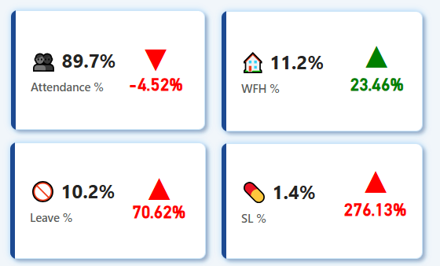
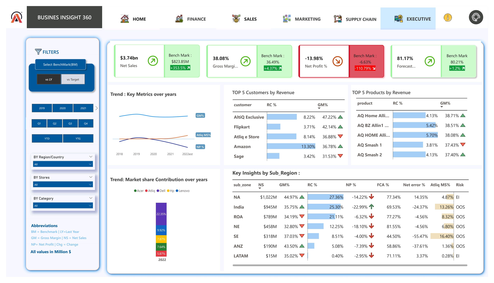

# 📊 AtliQ Business Insights – Power BI Dashboard

Welcome to my end-to-end Power BI Business Intelligence Project for **AtliQ Industries**, a fictional manufacturing company. This project was built as part of my Data Analytics learning journey and showcases my ability to convert raw data into compelling, actionable insights through professional dashboards and thoughtful DAX-driven analytics.

---

## 🚀 What’s Inside

This project dives into 5 key business functions:

- 📈 **Sales**
- 💰 **Finance**
- 📦 **Supply Chain**
- 📊 **Marketing**
- 🧠 **Executive View**

> It also includes a comprehensive home page to navigate across key metrics with interactive filters.

---

## 🧠 Business Context

AtliQ Industries needed a central BI solution to monitor the performance of different departments, track year-over-year growth, identify gaps vs. targets, and highlight areas of operational improvement.

As a **Data Analyst**, I took the role of transforming scattered datasets into a unified Power BI solution with deep financial and operational KPIs.

---

## 🛠️ Tools & Techniques Used

- **Power BI Desktop** – Data modeling, dashboard creation  
- **DAX (Data Analysis Expressions)** – Advanced KPIs, YOY%, Forecast Accuracy, Targets, Conditional Formatting  
- **Power Query** – Data shaping, cleaning & unpivoting  
- **Excel** – Data handling before import  
- **SQL (for initial practice stage)** – Not used in this specific build

---

## 🖼️ Dashboard Preview

| Page         | Preview |
|--------------|---------|
| 🏠 Home       | [Home](Images/Home.jpg) |
| 📊 Finance      | [Finance](Images/Finance.jpg) |
| 💰 Sales    | [Sales](Images/Sales.jpg) |
| 📦 Marketing  | [Marketing](Images/Marketing.jpg) |
| 📣 Supply Chain  | [Supply chain](Images/Supply Chain.jpg) |
| 🧠 Executive View | [Executive](Images/Executive.jpg) |

---

|--------------|---------|
| 🏠 Home|  
||
## 🖼️ Dashboard Previews

| KPI Cards | Attendance Over Time | SL % Trend |
|----------|----------------------|------------|
|  || 

---

## 📄 PDF Report

Click below to **view the entire dashboard in PDF format**:

👉 [🖥️ View AtliQ BI 360 PDF Dashboard](https://github.com/SENTHAMILAN27/Atliq-Business-Insights-PowerBI/blob/main/AtliQ_BI_360_Dashboard-%20PDF/AtliQ_BI_360_Dashboard.pdf.pdf)

---

## 🧮 DAX Measures

Curious how these metrics work under the hood? Check out the logic that powers this BI system:

- 📂 [PnL Measures](https://github.com/SENTHAMILAN27/Atliq-Business-Insights-PowerBI/blob/main/Measures%20Used/pnl_measures.txt.txt)
- 🎯 [Target & Benchmark Logic](https://github.com/SENTHAMILAN27/Atliq-Business-Insights-PowerBI/blob/main/Measures%20Used/targets_measures.txt.txt)
- 📊 [YOY & Forecast Accuracy](https://github.com/SENTHAMILAN27/Atliq-Business-Insights-PowerBI/blob/main/Measures%20Used/yoy_analysis.txt.txt)
- 🌈 [Visual Labels, Icons & Colors](https://github.com/SENTHAMILAN27/Atliq-Business-Insights-PowerBI/blob/main/Measures%20Used/yoy_analysis.txt.txt)
- 📉 [Forecast Accuracy Calculations](https://github.com/SENTHAMILAN27/Atliq-Business-Insights-PowerBI/blob/main/Measures%20Used/forecast_accuracy.txt.txt)
---

## 🎯 Key Highlights

- Interactive YOY and Target Benchmark Analysis
- Forecast Error Classifications (OOS / EI)
- Conditional Icons, Color Coding & KPI Cards
- Dynamic Measures based on selected year and benchmark
- Region-wise, Market-wise visualizations with parameter toggles

---

## 🙋‍♂️ About Me

With **2.5 years of experience in the IT banking domain**, I’ve always been fascinated by the “why” behind the numbers. Transitioning into Data Analytics was a natural step as I enjoyed building stories and solving problems using data. You can find my other projects and portfolio at:

👉 **[Visit My Portfolio Website](https://codebasics.io/portfolio/SENTHAMILAN-A)**  
👉 **[Connect with me on LinkedIn](https://www.linkedin.com/in/senthamilan27/)**

---

## 📫 Contact

📧 Email  :Senthamilanarivu@gmail.com

📞 Mobile :6382403356

🧳 Actively looking for opportunities in **Data Analytics / Business Intelligence**

---

⭐ **If you found this project useful or interesting, feel free to give this repo a star and share it!**
